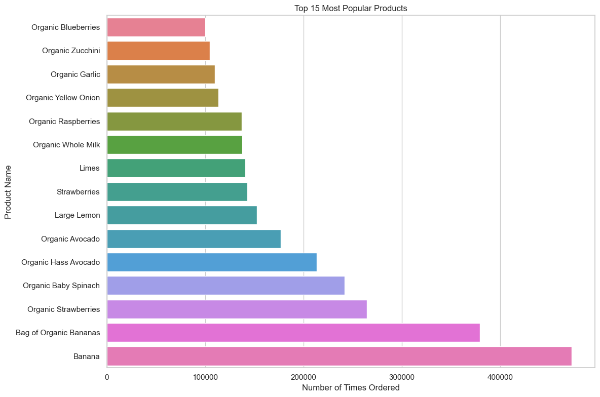
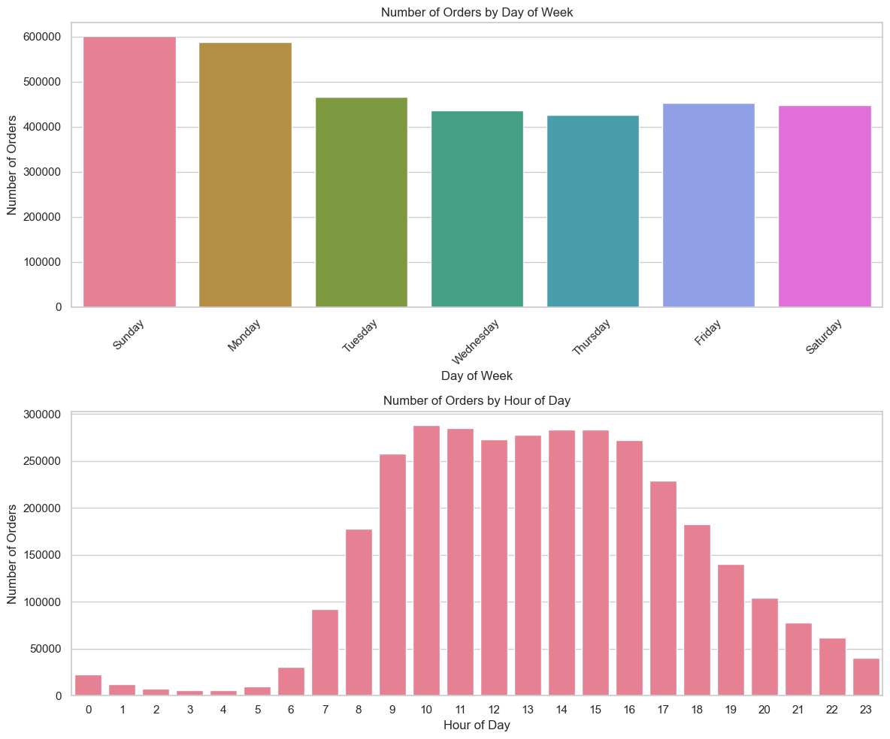
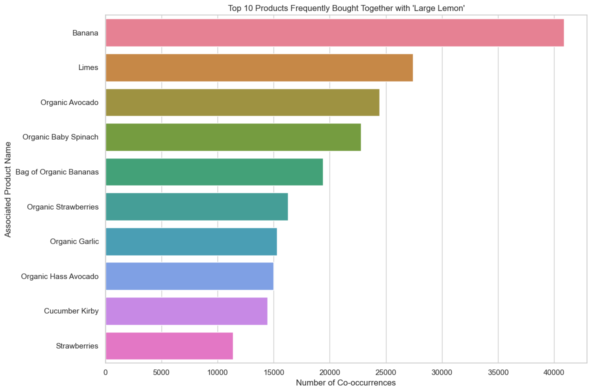

# 🛒 Instacart Market Basket & Customer Behavior Analysis

## 🎯 Business Problem
Instacart, a grocery delivery application, processes millions of orders annually. Understanding *when* customers buy and *what* they buy together is critical for business operations. This project aims to analyze a massive transactional dataset to:
1. Identify peak order times to optimize logistics and warehouse staffing.
2. Uncover hidden product associations (Targeted Market Basket Analysis) to improve the app's recommendation engine and cross-selling strategies.

## 📊 Key Business Insights
* **The "Workday Delivery" Trend:** The absolute peak for grocery orders falls on Sundays and Mondays. However, daily order volume plateaus at a high level strictly between **09:00 AM and 05:00 PM**. Customers predominantly order during standard working hours, requiring maximum courier availability during daytime shifts.
* **The "Guacamole Index" (Product Synergy):** A targeted association analysis on `Large Lemon` revealed strong cross-selling potential. Bypassing standard staples (like Bananas), customers who buy lemons frequently co-purchase `Limes`, `Organic Avocado`, `Organic Garlic`, and `Organic Baby Spinach`. This indicates a strong pattern of purchasing fresh ingredients for salads and Mexican cuisine, presenting an opportunity for targeted UI bundling.

## 📈 Visualizations

### Top 15 Most Popular Products

### Order Distribution (Day & Hour)

### Targeted Market Basket Analysis ('Large Lemon')

## 🛠️ Tech Stack & Tools
* **Language:** Python
* **Data Manipulation:** `pandas` (Heavy focus on data quality checks and memory optimization)
* **Data Visualization:** `seaborn`, `matplotlib`
* **Development Environment:** Cursor (AI-assisted IDE) / Jupyter Notebook
* **Version Control:** Git, GitHub

## 🧠 Technical Challenges Overcome
* **Memory Management:** The core dataset (`order_products__prior.csv`) contained over **32 million rows**. To prevent out-of-memory (OOM) errors during the `merge` operations, I implemented strict **data type downcasting** (e.g., casting IDs to `int32` and flags to `int8`) upon loading, significantly reducing the RAM footprint.

## 🗂️ Data Source
The data is sourced from the official [Instacart Market Basket Analysis competition on Kaggle](https://www.kaggle.com/datasets/psparks/instacart-market-basket-analysis).

## 🚀 How to Run Locally
1. Clone this repository: `git clone https://github.com/BloodRedSunSet/Instacart-Market.git`
2. Download the dataset from Kaggle and extract it into a `data/` folder in the root directory.
3. Install required packages: `pip install pandas matplotlib seaborn`
4. Run the Jupyter Notebook `eda.ipynb` to view the analysis step-by-step.
